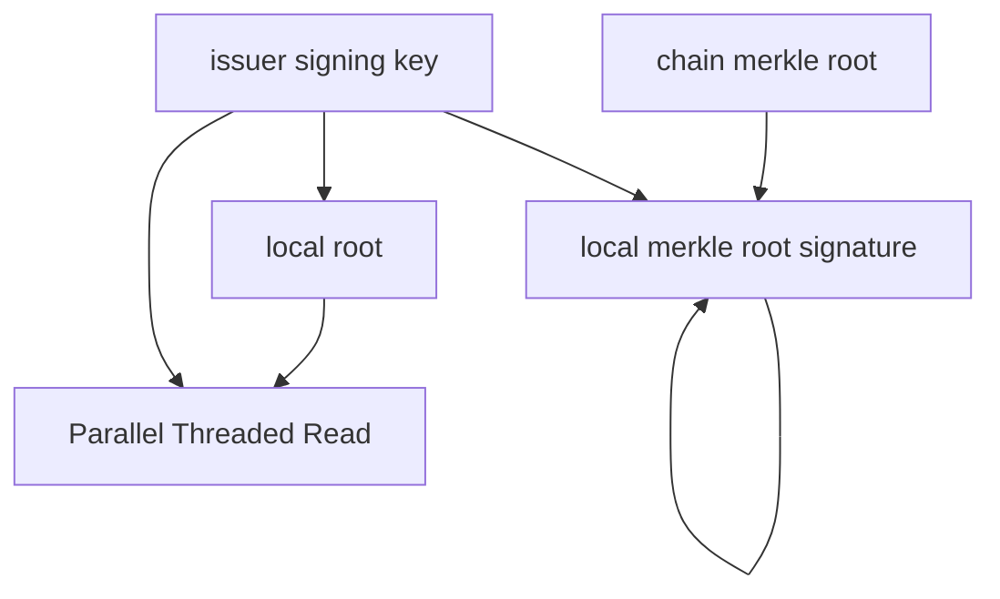

# Project Overview

```mermaid
graph TD
    A[chain merkle root] --> B[chain merkle tree] --> B[local merkle root signature]
    C[issuer signing key] --> B
    C --> D[local root]
    D --> E[resource]
    C --> E[Parallel Threaded Read]
```
